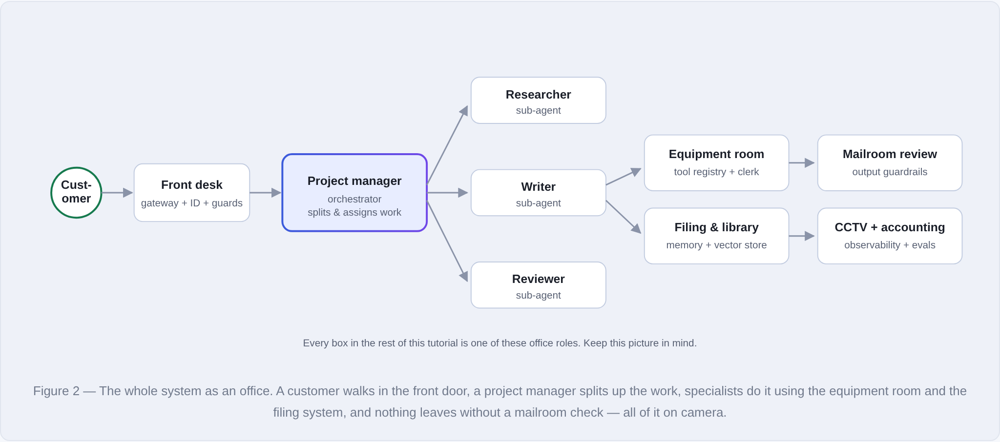
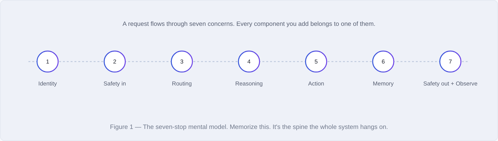
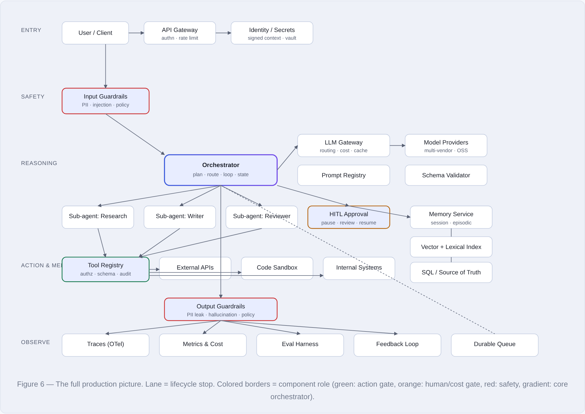

# Designing a Production-Grade Agentic System

> A step-by-step, beginner-friendly tutorial on how to architect a real agentic AI system — what every component does, where it lives, what breaks if you forget it, and the trade-offs behind each decision.

Most explanations of "agentic systems" hand you a pile of boxes — orchestrator, vector store, guardrails, LLM gateway — and leave you to guess how they fit together. This tutorial does the opposite: it **builds the system one component at a time**, starting from the simplest thing that works and adding each piece only after explaining the concrete problem it solves. Every component is tied to a real-world analogy, a worked example, and a clear note on *what breaks without it*.

---

## Read it

| Format | Best for | Link |
| --- | --- | --- |
| **Interactive HTML** | Reading in the browser, full color, all diagrams | [`index.html`](index.html) — or the live version via GitHub Pages (see below) |
| **PDF** | Offline reading, printing, sharing | [`agentic-system-design-tutorial.pdf`](agentic-system-design-tutorial.pdf) |

> [!TIP]
> The HTML file is fully self-contained — no internet, no dependencies. Download it and open it in any browser, or read the PDF if you'd rather not open an HTML file.

---

## The big idea

Your agentic system is a **busy office** that handles customer requests. Every technical component has an office equivalent — and once you see the mapping, the architecture stops feeling like jargon.

A customer walks in the front door (**gateway + identity + guardrails**), a project manager (**orchestrator**) splits up the work and assigns it to specialists (**sub-agents**), who use the equipment room (**tool registry**) and the filing system (**memory + vector store**) to get it done — and nothing leaves without a mailroom check (**output guardrails**), all of it on camera (**observability**).

Underneath the analogy is one simple spine: every request flows through the same seven concerns, in order. Each component you add lives on one of these stops.

---

## What's inside

The tutorial builds up the full architecture below, lane by lane, with every component tagged by **severity** — how badly you'll miss it in production.

**Core components (the visible spine):**

- **LLM Gateway** — the single chokepoint for every model call (routing, retries, cost, failover)
- **Orchestrator** — breaks a request into steps and routes them
- **Sub-agents** — specialized workers the orchestrator delegates to
- **Tool Registry** — the security boundary where tool calls are validated, authorized, and logged
- **Memory** — working / session / episodic / knowledge, and where each one lives
- **Vector Store & Retrieval** — meaning-based + keyword search (RAG), and why it isn't "the memory"
- **Guardrails** — input *and* output safety (two boxes, not one)
- **Observability** — traces, cost telemetry, and agent decision logs

**The components most first builds forget (woven into the relevant steps):**

cost / budget router · response caching · prompt & model version registry · secrets manager · data-plane / privacy isolation · durable execution & retries · human-in-the-loop approval · schema validator · identity propagation · eval & feedback loop

---

## What makes this different

- 🧭 **Built progressively** — every box is introduced *after* the problem it solves, never before.
- 🏢 **One running analogy** — the office metaphor threads through the whole system.
- 🧪 **A worked example** — one request (*"find our top 3 customers by revenue and draft a thank-you email to each"*) is traced through every component.
- 🚦 **Severity labels** — each component is tagged Critical / High / Medium / Low so you know what to build first.
- 💥 **"What breaks without it"** — a failure mode for every single component.
- 📖 **Plain-English glossary** — 37 terms and abbreviations (RAG, DAG, PII, HITL, idempotency, embeddings, …) explained simply.

---

## Who this is for

- Engineers building their **first** agentic / LLM-powered system who want the full picture before they start.
- People who know what the individual pieces *are* but aren't sure how they **connect** or which decisions matter.
- Anyone preparing to design, review, or reason about an agentic architecture and wanting a clear mental model.

No prior LLM-infrastructure experience is assumed — every technical term is expanded on first use and collected in the glossary.

---

## Table of contents

1. The mental model: a request's journey
2. The naive baseline (and why it fails)
3. The LLM Gateway
4. The Orchestrator
5. Sub-agents
6. The Tool Registry
7. Memory (the question that trips everyone up)
8. Vector Store & Retrieval
9. Guardrails (input + output)
10. Observability
11. The big picture: every component in one map
12. Failure-mode catalog
13. A build sequence you can follow
14. Plain-English glossary

---

## Viewing the interactive version online (optional)

You can publish the HTML for free with **GitHub Pages**:

1. Push this repo to GitHub.
2. Go to **Settings → Pages**.
3. Under **Build and deployment**, set **Source** to `Deploy from a branch`, branch `main`, folder `/ (root)`.
4. Wait a minute, then open `https://<your-username>.github.io/<repo-name>/` — it serves `index.html` automatically.

---

## License

Released under the [MIT License](LICENSE) — free to use, share, and adapt with attribution.

If this helped you, a ⭐ on the repo is appreciated.
